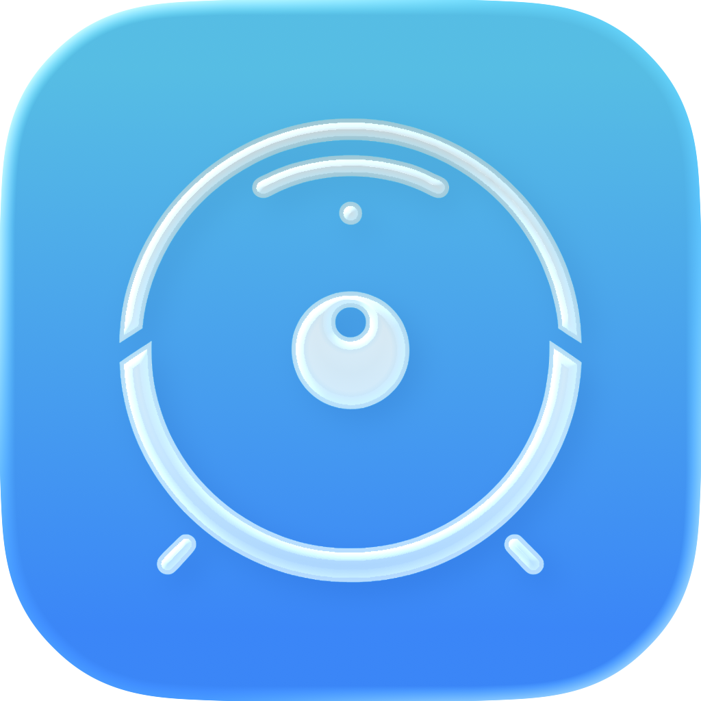

  

<h1 align="center">ValetudiOS</h1>

  Native iOS-App für <a href="https://valetudo.cloud">Valetudo</a> Saugroboter.

## Features

- **Multi-Roboter-Unterstützung**: Verwalte mehrere Valetudo-Roboter in einer App
- **Live-Kartenansicht**: Interaktive Karte mit Raumauswahl, Zonenreinigung und Zielorten
- **Echtzeit-Status**: Akku, Reinigungsstatus und Live-Statistiken
- **Volle Kontrolle**: Starten, Stoppen, Pausieren und nach Hause schicken
- **Verbrauchsmaterial-Tracking**: Filter, Bürsten und Sensoren im Blick
- **Raumreinigung**: Bestimmte Räume mit individuellen Durchgängen reinigen
- **Zonenreinigung**: Eigene Reinigungszonen zeichnen und speichern
- **Virtuelle Sperrzonen**: No-Go-Zonen und virtuelle Wände erstellen
- **Zielorte**: Lieblingsorte speichern und verwalten
- **Siri-Kurzbefehle**: Sprachsteuerung für häufige Aktionen
- **Push-Benachrichtigungen**: Über Reinigungsstatus und Fehler informiert werden
- **Dark Mode**: Vollständige Unterstützung für den Dunkelmodus
- **Lokalisierung**: Deutsch und Englisch

## Voraussetzungen

- iOS 17.0+
- Valetudo 2024.06.0+
- Roboter im lokalen Netzwerk erreichbar

## Installation

### App Store

Demnächst verfügbar.

### Selbst kompilieren

1. Repository klonen
2. `ValetudoApp.xcodeproj` in Xcode öffnen
3. Auf dem Gerät bauen und ausführen

## Konfiguration

1. App starten
2. Roboter mit IP-Adresse oder Hostname hinzufügen
3. Optional: Authentifizierung aktivieren, falls in Valetudo konfiguriert

## Unterstützte Roboter

ValetudiOS funktioniert mit allen Saugrobotern, die Valetudo unterstützen:

- Roborock (S5, S5 Max, S6, S7, etc.)
- Dreame (L10 Pro, Z10 Pro, L20 Ultra, etc.)
- Xiaomi/Viomi
- Und viele mehr

## Screenshots

*Screenshots folgen*

## Mitwirken

Beiträge sind willkommen! Pull Requests können gerne eingereicht werden.

## Lizenz

Dieses Projekt steht unter der GNU General Public License v3.0 - siehe [LICENSE](LICENSE) für Details.

## Danksagung

- [Valetudo](https://valetudo.cloud) - Die Open-Source Saugroboter-Firmware
- Allen Valetudo-Entwicklern und der Community

## Hinweis

Dies ist eine inoffizielle Companion-App. ValetudiOS ist nicht mit dem Valetudo-Projekt verbunden oder von diesem unterstützt.

---

## Datenschutzerklärung

### Verantwortlicher

Simon Luthe
Süderstraße 18
25779 Hennstedt
Deutschland

E-Mail: mail@simonluthe.de
Telefon: +49 151 21563194
Web: [simonluthe.de](https://simonluthe.de)

### Datenverarbeitung

**ValetudiOS speichert und verarbeitet folgende Daten ausschließlich lokal auf deinem Gerät:**

- IP-Adressen/Hostnamen deiner Valetudo-Roboter
- Optionale Zugangsdaten (Benutzername/Passwort) für die Roboter-Authentifizierung
- App-Einstellungen und Präferenzen
- Gespeicherte GoTo-Punkte

**Es werden keine Daten an externe Server übertragen.** Die gesamte Kommunikation erfolgt ausschließlich zwischen deinem iOS-Gerät und deinen Valetudo-Robotern in deinem lokalen Netzwerk.

### Keine Tracking- oder Analysedienste

ValetudiOS verwendet:
- Keine Analytics oder Tracking-Tools
- Keine Werbung
- Keine Cloud-Dienste
- Keine Drittanbieter-SDKs, die Daten sammeln

### Netzwerkverbindungen

Die App stellt ausschließlich Verbindungen zu den von dir konfigurierten Valetudo-Robotern her. Diese Verbindungen bleiben vollständig in deinem lokalen Netzwerk.

### Datenspeicherung

Alle Daten werden lokal in der iOS-Keychain (für Zugangsdaten) bzw. in den App-Einstellungen gespeichert. Bei Deinstallation der App werden alle Daten vollständig entfernt.

### Deine Rechte (DSGVO)

Da alle Daten ausschließlich lokal auf deinem Gerät gespeichert werden und keine Übertragung an den Entwickler oder Dritte erfolgt, hast du die volle Kontrolle über deine Daten. Du kannst diese jederzeit durch Löschen der App vollständig entfernen.

Bei Fragen zum Datenschutz kannst du dich jederzeit an die oben genannte Kontaktadresse wenden.

### Änderungen

Diese Datenschutzerklärung kann bei Bedarf aktualisiert werden. Die aktuelle Version ist stets in diesem Repository verfügbar.

*Stand: Dezember 2025*
